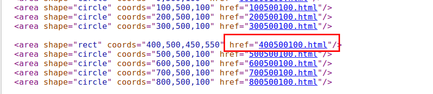
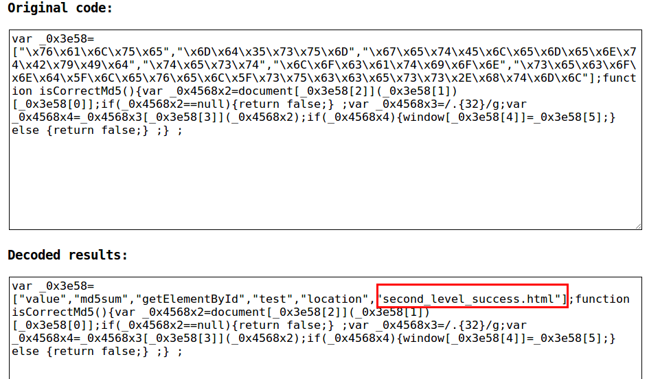

### Run my code
    python solution.py

### How I get to forth floor

It is very. I can always find the url for the next page.
Even though some of them are encoded, I can decoded them esaily.
For example.

